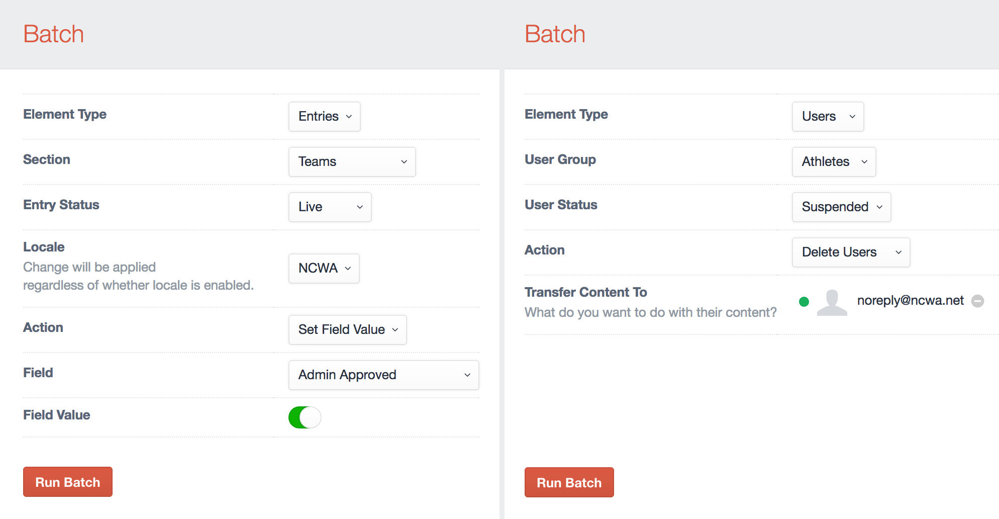

# Batch plugin for Craft CMS

Easily batch set field values across users or entries.

## Installation

To install Batch, follow these steps:

1. Download & unzip the file and place the `batch` directory into your `craft/plugins` directory
2.  -OR- do a `git clone https://github.com/chasegiunta/batch.git` directly into your `craft/plugins` folder.  You can then update it with `git pull`
3.  -OR- install with Composer via `composer require chasegiunta/batch`
4. Install plugin in the Craft Control Panel under Settings > Plugins
5. The plugin folder should be named `batch` for Craft to see it.  GitHub recently started appending `-master` (the branch name) to the name of the folder for zip file downloads.

Batch works on Craft 2.4.x and Craft 2.5.x.

## Batch Overview

A simple plugin for batch (re)setting field values either across users or entries.

## Using Batch

## Disclaimer

Very simple implementation. Doesn't support Matrix, Super Table, Neo, or other advanced fields.

## Batch Roadmap

* Set multiple fields & values
* Add support for other elements
* Allow filtering through twig

Brought to you by [ChaseGiunta](chasegiunta.com)
